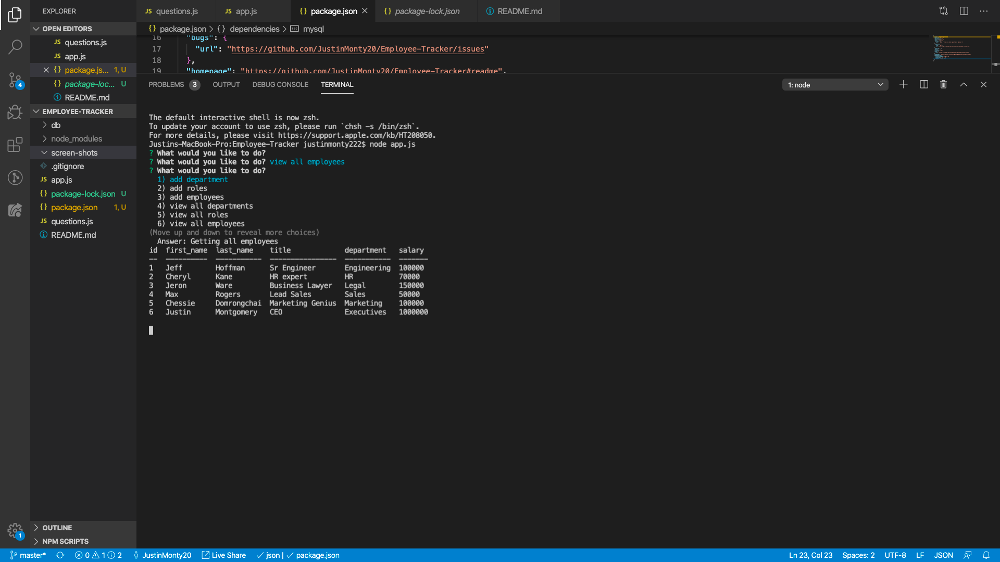
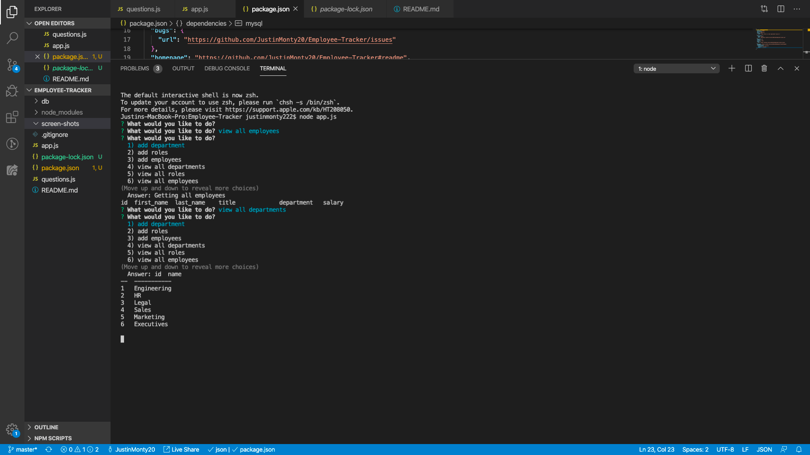

# Employee-Tracker

As a business owner
I want to be able to view and manage the departments, roles, and employees in my company
So that I can organize and plan my business

1. running node app.js will start the application where they can click on a couple options.
2. You can add a department, role, or an employee to the sql database
3. You can also view all the roles, departments, and employees that are in the database.
4. There is an option to update an existing role in the database. 
5. quit the application and end the connection on the server with by choosing the quit option from the list. 

Link to the github. 
https://github.com/JustinMonty20/Employee-Tracker
